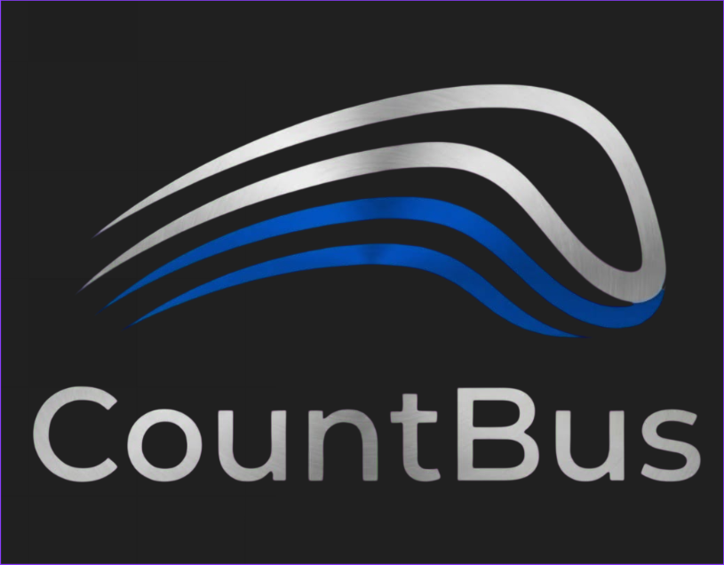

# 🚍 CountBus — Inteligência e Contagem de Passageiros

### **Transforme dados em lucro no transporte urbano**

[🌐 Acesse nossa página demonstrativa](https://countbus.github.io/CountBus-public/)

---

> [!IMPORTANT]
> **Nota de Confidencialidade e Versão Demonstrativa**  
> Este repositório contém uma **versão pública e resumida** da *landing page* da **CountBus**. Por questões de confidencialidade, patentes em andamento e proteção de propriedade intelectual durante o desenvolvimento ativo do projeto, os sistemas de backend, algoritmos de visão computacional, APIs e detalhes de hardware permanecem privados.

## 📌 Sobre a CountBus

Empresas de transporte que operam no escuro perdem dinheiro todos os dias. A **CountBus** é uma solução de inteligência operacional e contagem automática de passageiros (APC) projetada para eliminar o "achismo" na gestão de frotas.

Nossa plataforma transforma cada ônibus em uma fonte de dados estratégicos em tempo real, fornecendo métricas precisas sobre ocupação, rotas e horários para otimizar custos e maximizar o retorno operacional.

---

## 💡 Soluções e Vantagens Competitivas

| # | Vantagem | Descrição |
|---|---|---|
| 1️⃣ | **Mais Lucro** | Redução de viagens desnecessárias e ajuste inteligente da frota. |
| 2️⃣ | **Decisões por Dados** | Identificação exata de horários de pico e otimização de rotas. |
| 3️⃣ | **Redução de Prejuízos** | Detecção de viagens inconsistentes e controle real da operação. |
| 4️⃣ | **Poder em Licitações** | Dados confiáveis e comprováveis para fortalecer a posição com prefeituras. |
| 5️⃣ | **Diferencial Competitivo** | Inovação tecnológica que melhora o transporte e reduz superlotação. |
| 6️⃣ | **Modelo de Parceria** | Investimento acessível por veículo que se paga rapidamente na operação. |

---

## 🏆 Trajetória e Reconhecimento

- **🥇 1º Lugar no MVP Config 2025**: Reconhecimento máximo pela tecnologia inovadora apresentada a líderes do setor.
- **🚀 Startup Day**: Apresentação de pitch para investidores e especialistas do ecossistema de inovação.

---

## 🛠️ Tecnologias da Landing Page

- **HTML5 Semântico**: Estruturação acessível e otimizada para SEO.
- **CSS3 Moderno**: Layout responsivo com design *Glassmorphism*, modo escuro/claro (*Dark/Light Mode*) e animações suaves.
- **JavaScript Vanilla (ES6+)**: Lógica dinâmica para navegação, navegação suave e alternância de temas.
- **Font Awesome 6**: Iconografia moderna e intuitiva.

---

## 👨‍💻 Equipe de Desenvolvimento

- **Bruno Lima** — *Desenvolvedor* — 
- **Guilherme B.** — *Desenvolvedor* — 
- **Guilherme Francini** — *Desenvolvedor* — 
- **Samuel Santos** — *Desenvolvedor* — 

---

## ✉️ Contato e Suporte

- **E-mail:** [count4bus@gmail.com](mailto:count4bus@gmail.com)
- **WhatsApp:** [Fale Conosco](https://wa.me/5511917652794)
- **LinkedIn:** [CountBus Oficial](https://www.linkedin.com/in/countbus-undefined-3187743b8/)

---

© 2026 CountBus. Transforme passageiros em estratégia.

